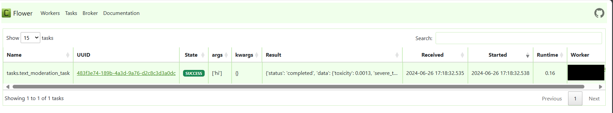

# Moderation api

welcome to moderation_api_py a simple api that uses different AI models to moderate text and images in a fast and
efficient way using FastAPI and Celery.

Celery is used to perform the moderation tasks in the background and store the results in a Redis database.

## how to run :

### With docker:

Create a `docker-compose.yml` file:

```yaml
services:
  api:
    image: ghcr.io/brahimabd98/moderation_api_py:main
    ports:
      - "8000:8000"
    environment:
      DATABASE_URL: "redis://redis:6379/0"
  redis:
    image: redis:alpine
    ports:
      - "6379:6379"
    volumes:
      - redis-data:/data
```

docker [image](https://github.com/brahimABD98/moderation_api_py/pkgs/container/moderation_api_py) :

```shell
docker pull ghcr.io/brahimabd98/moderation_api_py:main
```

### locally with GitHub

Start a new terminal session and clone the project with this command :

```shell
git clone github.com/brahimabd98/moderation_api_py/
```

cd into the project :

```shell
cd moderation_api_py
```

Start a new venv (optional):

```shell
python -m venv .venv
```

Install the project's dependencies:

```shell
pip install -r requirements requirements.txt
```

**set up the .env file (checkout .env.example)**

```shell
cp .env.example .env
```

start the project

```shell
fastapi run main.py --port 8000
```

#### Redis:

- **make sure you have a running Redis db instance, you can check their docs for more [info](https://redis.com)**


You can use the provided docker
[image](https://github.com/brahimABD98/moderation_api_py/pkgs/container/moderation_api_py) :

```shell
docker pull ghcr.io/brahimabd98/moderation_api_py:main
```

# screenshots:

### swagger ui [http://localhost:8000/docs](http://localhost:8000/docs)


## flower dashboard [http://localhost:5555](http://localhost:5555)

### task list:



### task:


## features:

* task execution with celery queue you can follow the state of each task with either the /task endpoint or by launching
  the local flower web dashboard by visiting
  http://localhost:5555
* Image moderation (link below):
    * nsfw score: ranging from 0 to approx 1
    * normal score : ranging from 0 to approx 1
    * summary: to be improved, right now it just describes whether the image is nsfw with a thresh-hold of 0.5
      for better readability.
* Text moderation (link below) :
    * toxicity
    * severe toxicity
    * obscene
    * identity attack (refer to detoxify docs)
    * insult
    * threat
    * sexual explicit content
    * summary: to be improved upon, right now it just describes the current issues with the text based on score
      thresh-hold of 0.5 for better readability
* Video moderation :working, but it's still WIP
* background tasks:
  All the moderation tasks are performed as a background task and saved inside a Redis database.
* Authentication by api keys middleware is implemented.

## Planned Improvements:

- testing
- automatic task re-execution
- rate limiting: limit the amount of request.
- api gateway
- caching
- task priority
- grafana and Prometheus integration

## Non-goals (subject to change) :

- multiple image processing
- html sanitization
- censorship: apply blur filter or text censorship of certain words
- measuring model performance

## credits :

- text moderation : [detoxify](https://github.com/unitaryai/detoxify)
- image moderation : [Falconsai/nsfw_image_detection](https://huggingface.co/Falconsai/nsfw_image_detection)

### disclaimers :

> - ethical considerations:
    as the author of the different AI models, these kinds of classifications
    shouldn't be taken at face value and human intervention should
    present for the final decision.
>- performance: yet to be determined.
>- Error handling: currently there's no proper error handling, so the server is prone to **crashing**
>- logging: right there's no good structured logging we plan to add in the future

credit: Brahim, 2024 